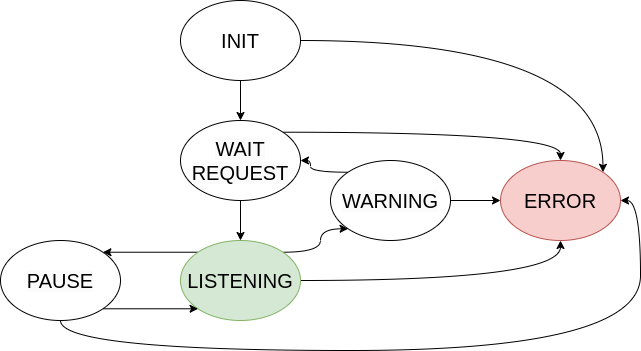
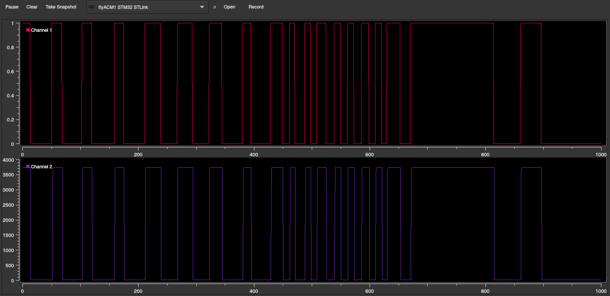
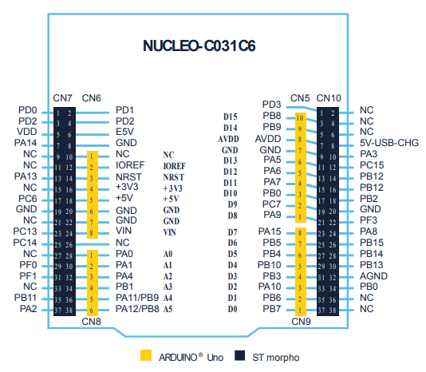

# Recruting SW Microcontroller Eagle Application project

This is the project with witch I'm applying to enter the Eagle Team (UniTn).
The task consisted in creating a firmware for a nucleo board that would read
the HALL sensor analog and digital pins and send them thru serial, to plot them
on the host pc.

## How it works

### Finite State Machine

The program flow is primarily controlled by a Finite State Machine with the
following states:
- **Init**: Startup some structs used by the FSM
- **Wait Request**: Receive commands from the serial to change the output of
  the Listening state until the on-board button is pressed
- **Listening**: The on-board led is on , the cli is off and the nucleo is
  reading analog and digital data from the HALL sensor, the analog data
  before being sent is processed thru 3 different filters chosen thru the cli,
  if the on-board button is pressed the FSM transition to Pause
- **Pause**: Same as Wait Request but the on-board led is blinking with a
  period of 2000ms and a duty cycle of 50%
- **Warning**: The state is entered when the digital pin, in the Listening
  state, reads 0 for more than 5 seconds uninterrupted, then it spam `WARNING`
  in the serial
- **Error**: If any error occur in any state the FSM will transition to this
  state. The on-board led will blink with a period of 400ms and a duty cycle of
  50% and in the serial it will be spammed `ERROR`, the only way to exit the
  state is by pressing the reset button on the nucleo board

### CLI

The command line interface is active only in the **Wait Request** and **Pause**
states, all the commands modifies the filter applied to the analog data read by
the sensor. The possible commands are the following:
- `raw`: no filter applied
- `avg`: does the moving average of the last 150 elements
- `noise`: adds random noise to the signal

## How it plots

To plot the incoming data from serial I've decided to use `SerialPlot`, a
simple qt application. First off all connect the board serial to the host pc,
then start `SerialPlot` and import the settings from the `serialplot.ini` file.
Open the connection with the Nucleo Board and press the on-board button to
start the reading.

 

## The hardware

-   ||
    |:----------------------------:|
    |*STM32 Nucleo Board C031C6*|
- HALL sensor

### Wiring

| Nuclo Board Pin | HALL Sensor |
|---------------- | ----------- |
| PA4             | D0          |
| PB1             | A0          |
| +3v3            | VCC         |
| GND             | GND         |

